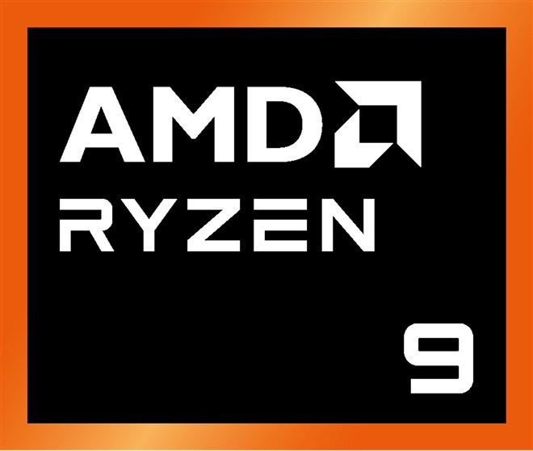

# ✨ AMD PCStore ✨

<p align="center">
  
</p>

A modern and sleek prototype web store for computer components, focused on AMD products. Built with cutting-edge full-stack technologies.

<p align="center">
  
  
  
  
  
  
  
  
</p>

## 🌟 Implemented Features

*   **Modern and Striking Design:** Elegant user interface with Tailwind CSS (v4) and fluid animations using Framer Motion.
*   **Intuitive Navigation:** Modern and responsive Navbar, and an informative footer. The Navbar dynamically updates based on user authentication status and roles.
*   **Dynamic Homepage:**
    *   Background video with blur effect and playback control.
    *   Main product sections (Ryzen, Radeon) with scroll animations and interactive hover effects (simulated percentage/FPS circles).
*   **User Authentication and Authorization:**
    *   New user registration with secure password hashing (bcrypt).
    *   User login with JSON Web Token (JWT) generation.
    *   User role management (user, admin).
    *   Protected routes on both frontend and backend based on authentication and roles.
    *   "My Account" page for logged-in users, displaying profile information and purchase history.
*   **Product Catalog:**
    *   Listing of AMD graphics cards and processors served from a PostgreSQL database via a NestJS API.
    *   Detail page for each product.
    *   Text search functionality within the catalog.
    *   Filters by product type (CPU/GPU).
    *   Navigation to pre-applied filters from the homepage.
*   **Functional Shopping Cart:**
    *   Authenticated users can add products to their cart.
    *   Cart view with options to update quantities and remove items.
    *   Ability to empty the entire cart (with confirmation).
    *   Persistent backend interaction for cart management.
*   **Simulated Purchase Process:**
    *   Checkout page to review the order.
    *   "Confirm Purchase" button that creates an order in the database and empties the cart.
    *   Order confirmation page.
*   **Product Management for Administrators (CRUD):**
    *   Protected admin interface for users with the 'admin' role.
    *   Listing of all products from the database.
    *   Form to create new products.
    *   Functionality to delete existing products (with confirmation).
    *   (Placeholder for product editing).
*   **Robust and Scalable Backend:**
    *   API built with NestJS and TypeScript.
    *   Integration with PostgreSQL using TypeORM for data persistence (users, products, carts, orders).
    *   Input data validation (DTOs) with `class-validator`.
    *   CORS configuration for secure communication between frontend and backend.
*   **Optimized Development Experience:**
    *   Use of Vite for ultra-fast Hot Module Replacement (HMR) in the frontend.
    *   Modular and well-organized project structure.
*   **Improved UI/UX:**
    *   Notifications (toasts) for user actions (e.g., product added to cart, login error, etc.).
    *   Loading indicators for asynchronous operations.
    *   Error state handling.

## 🛠️ Technologies Used

*   **Frontend (`client/`):**
    *   [React.js](https://reactjs.org/)
    *   [Vite](https://vitejs.dev/)
    *   [TypeScript](https://www.typescriptlang.org/)
    *   [Tailwind CSS v4](https://tailwindcss.com/blog/tailwindcss-v4)
    *   [React Router DOM](https://reactrouter.com/)
    *   [Framer Motion](https://www.framer.com/motion/)
    *   [React Icons](https://react-icons.github.io/react-icons/)
    *   [React Hot Toast](https://react-hot-toast.com/)
    *   React Context API
*   **Backend (`server/`):**
    *   [Nest.JS](https://nestjs.com/)
    *   [TypeScript](https://www.typescriptlang.org/)
    *   [PostgreSQL](https://www.postgresql.org/)
    *   [TypeORM](https://typeorm.io/)
    *   [JWT (JSON Web Tokens)](https://jwt.io/)
    *   [bcrypt](https://www.npmjs.com/package/bcrypt)
    *   `class-validator`, `class-transformer`
    *   `@nestjs/config`

## ⚙️ Setup and Local Execution

### Prerequisites

*   [Node.js](https://nodejs.org/) (v18.x or v20.x recommended)
*   [npm](https://www.npmjs.com/)
*   [Git](https://git-scm.com/)
*   A running and accessible instance of **PostgreSQL**.

### Installation Steps

1.  **Clone the repository:**
    ```bash
    git clone https://github.com/bryanHcarvajal/modern-pc-store.git
    cd modern-pc-store
    ```

2.  **Backend Setup:**
    *   Navigate to the server folder:
        ```bash
        cd server
        ```
    *   **Create the `.env` file:**
        From PowerShell, inside the `server/` folder, run:
        ```powershell
        New-Item .env
        ```
        Then, open the newly created `.env` file with a text editor (like VS Code, Notepad, etc.) and paste the following content, **making sure to replace the placeholder values with your actual credentials and secrets**:
        ```env
        # PostgreSQL Configuration
        DB_TYPE=postgres
        DB_HOST=localhost
        DB_PORT=5432
        DB_USERNAME=your_postgres_user
        DB_PASSWORD=your_postgres_password
        DB_DATABASE=modern_pc_store_db # Or the name you gave to your DB
        DB_SYNCHRONIZE=true # For development

        # JWT Configuration
        JWT_SECRET=YOUR_UNIQUE_AND_LONG_SUPER_SECRET_JWT_HERE
        JWT_EXPIRATION_TIME=3600s # e.g., 1 hour (you can use s, m, h, d)
        ```
        **Important:** Do not include quotes around the values in the `.env` file unless they are part of the value itself (they usually aren't for secrets or usernames).
    *   Install backend dependencies:
        ```bash
        npm install
        ```

3.  **Frontend Setup:**
    *   Navigate to the client folder:
        ```bash
        cd ../client
        # (If you were in server/, otherwise cd client/ from the root)
        ```
    *   Install frontend dependencies:
        ```bash
        npm install
        ```

### Running the Application

1.  **Start the Backend Server:**
    From the `server/` folder (in one terminal):
    ```bash
    npm run start:dev
    ```
    The backend will be available at `http://localhost:3000` (or the port configured in your `.env` or `main.ts`).

2.  **Start the Frontend Application:**
    From the `client/` folder (in a new terminal):
    ```bash
    npm run dev
    ```
    The frontend application will be available at `http://localhost:5173` (or the port Vite assigns).

Open your browser and go to the frontend URL to explore the store. To access admin functionalities, you will need to register a user and then modify their role to 'admin' directly in the PostgreSQL database (e.g., `UPDATE users SET roles = ARRAY['admin', 'user'] WHERE email = 'your_admin_email@example.com';` using `psql` or a database GUI tool).

## 📄 License

This project is for portfolio and learning purposes. Feel free to use it as a reference.

---

_Developed with ❤️, TypeScript, and lots of testing._
